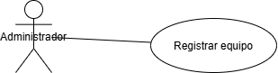

# Sistema de Gestión de Torneos de eSports

## Autor
Sabrina Aigbogun Mouataz  
[Perfil de GitHub](https://github.com/sabrinaunir)

## Descripción del Proyecto

Este proyecto modela un sistema para la gestión de equipos y jugadores en torneos de eSports, utilizando diagramas UML para representar la estructura y funcionalidad del sistema. Se enfoca en la parte de modelado UML, sin implementación en código Java.

## Diagramas UML

### Casos de Uso

#### Registrar equipo


#### Añadir jugador


#### Consultar lista de equipos y jugadores


### Diagrama de Clases


## Estructura del Proyecto

```
torneo-esports-uml/
├── src/
│   └── placeholder.txt
├── diagrams/
│   ├── teamRegister-useCase.png
│   ├── addPlayer2Team-useCase.png
│   ├── viewListTeamsAndPlayers-useCase.png
│   ├── clases.png
├── README.md
```

## Justificación del diseño

El sistema se ha modelado siguiendo una estructura modular clara, separando correctamente las clases en entidades, control e interfaz, para favorecer la escalabilidad y el mantenimiento del proyecto.

- **Entidades**: Se han definido las clases `Equipo` y `Jugador` como entidades principales que representan los datos esenciales del sistema.
- **Control**: La clase `GestorEquipos` actúa como clase de control, gestionando el registro de equipos, la adición de jugadores y la consulta de información.
- **Interfaz**: La clase `VistaAdmin` se encarga de la interacción con el usuario administrador, mostrando menús y listados.

En los diagramas de casos de uso se han desglosado las funcionalidades principales para representar de forma independiente acciones como registrar un equipo, añadir jugadores o consultar la lista de equipos y jugadores. En el caso de “Añadir jugador”, se ha representado correctamente la relación `<<include>>` con “Seleccionar equipo”.

El Diagrama de Clases refleja de manera sencilla las relaciones entre las entidades, destacando una agregación entre `Equipo` y `Jugador`, dado que un equipo puede contener múltiples jugadores. Las asociaciones simples entre `GestorEquipos`, `Equipo` y `VistaAdmin` representan la lógica de colaboración.

## Conclusiones

Esta actividad me ha permitido reforzar mis conocimientos en el análisis y modelado de sistemas utilizando diagramas UML.  
He aprendido a identificar correctamente los actores y casos de uso de un sistema, así como a diseñar su estructura mediante clases de entidad, control e interfaz.  
Además, he comprendido la importancia de aplicar relaciones como la agregación para representar adecuadamente los vínculos entre objetos.  
El uso de una arquitectura modular facilita la mantenibilidad y escalabilidad del sistema, aspectos clave en proyectos reales de desarrollo de software.
