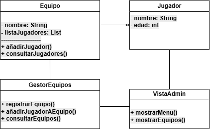

# Sistema de Gestión de Torneos de eSports

## Autor
Sabrina Aigbogun Mouataz  
(https://github.com/sabrinaunir)

## Descripción del Proyecto

Este proyecto implementa un sistema de gestión de torneos de eSports utilizando UML para el modelado.

## Diagramas UML

### Diagrama de Casos de Uso

### Diagrama de Clases

## Estructura del Proyecto

torneo-esports-uml/
├── src/
├── diagrams/
│   ├── casos-uso.png
│   ├── clases.png
├── README.md

## Instalación y Ejecución

Este proyecto no requiere instalación ni ejecución, ya que es únicamente el modelado UML.

## Justificación del diseño

Se ha elegido una estructura modular con clases de entidad, control e interfaz separadas para asegurar el mantenimiento del sistema.

## Conclusiones

Esta actividad ha permitido comprender la importancia del análisis y modelado previo al desarrollo de software.
